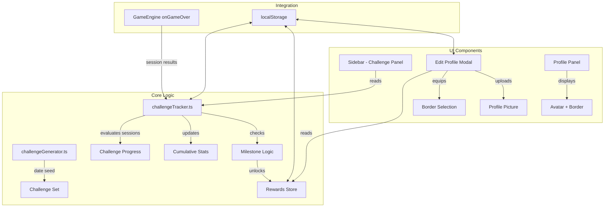
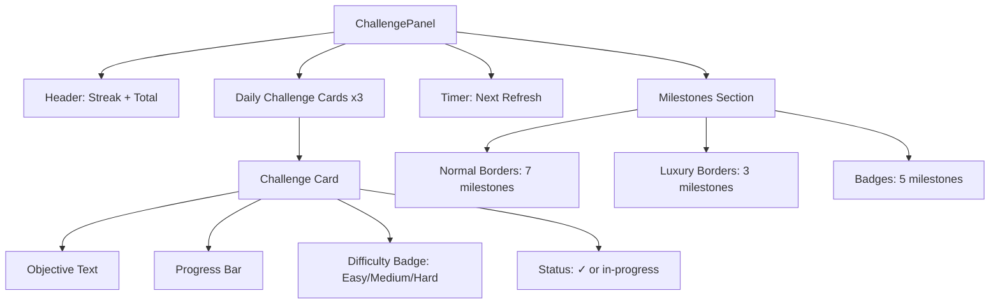

# Design Document: Daily Challenges

## Overview

This design introduces a Daily Challenges system for aimX that generates 3 deterministic daily challenges, tracks progress against game sessions, maintains cumulative stats and streaks, unlocks cosmetic rewards (Profile Borders and Badges) at milestone thresholds, and provides an Edit Profile modal for avatar customization and border equipping.

All persistence uses localStorage (no backend). Challenge generation is deterministic and date-seeded so the same day always produces the same challenge set. The system integrates with the existing `GameEngine` by hooking into game-over callbacks to evaluate session results against active challenges.

### Design Decisions

1. **Deterministic seeded generation over random**: Using the date string as a seed for a simple hash-based PRNG ensures challenges are reproducible, testable, and consistent across page refreshes. No server-side state needed.

2. **localStorage with JSON serialization**: Matches the existing project pattern (settings, equipped badge). All challenge data lives under `aimX_challenges_*` keys with versioned schemas for future migration.

3. **Sidebar panel integration**: The challenge panel becomes a new sidebar icon/panel alongside Profile, Friends, Analytics, and Settings — consistent with the existing navigation pattern.

4. **Edit Profile as a modal overlay**: A modal (not a panel) keeps the profile editing experience focused and prevents navigation confusion. Triggered by a pencil icon on the profile section.

5. **Progress evaluation at game-over only**: Evaluating challenges when a session ends (not during) keeps the game loop clean and avoids performance overhead during gameplay.

6. **Milestone rewards are permanent**: Once unlocked, borders and badges persist even if the streak resets. This prevents frustrating loss of earned cosmetics.

## Architecture



### Module Responsibilities

| Module | File | Responsibility |
|--------|------|----------------|
| Challenge Generator | `lib/challengeGenerator.ts` | Deterministic date-seeded challenge set creation |
| Challenge Tracker | `lib/challengeTracker.ts` | Progress tracking, streak management, milestone evaluation |
| Challenge Panel | `components/ChallengePanel.tsx` | Daily challenges UI, progress display, milestones view |
| Edit Profile Modal | `components/EditProfileModal.tsx` | Avatar upload, border selection grid |
| Sidebar (modified) | `components/Sidebar.tsx` | New challenge icon, profile border display, edit icon |

## Components and Interfaces

### Challenge Panel (Sidebar Panel)

The challenge panel is accessed via a new calendar/target icon in the sidebar icon column. It displays:

1. **Header**: Current streak 🔥 and total challenges completed
2. **Daily Challenges**: 3 cards showing objective, progress bar, difficulty badge, completion status
3. **Countdown Timer**: Time until next midnight refresh
4. **Milestones Section**: Scrollable list of all milestones with progress indicators



### Edit Profile Modal

Triggered by a pencil icon overlaid on the profile section's avatar area. Contains:

1. **Profile Picture Section**: Current avatar preview, upload button (accepts .png/.jpg/.jpeg), file validation
2. **Border Selection Grid**: Two tiers displayed — Normal (7) and Luxury (3). Locked borders show reduced opacity + lock overlay. Clicking an unlocked border equips it.
3. **Action Buttons**: Save/Close

### Profile Panel Modifications

- Avatar displays the uploaded profile picture (or default icon)
- Equipped border PNG renders as an overlay/frame around the avatar
- Pencil edit icon positioned at top-right of the avatar area

## Data Models

```typescript
// --- Challenge Types ---

type ChallengeObjectiveType = 
  | 'score_threshold'
  | 'accuracy_threshold'
  | 'hit_count'
  | 'session_count'
  | 'reaction_time';

type ChallengeDifficulty = 'easy' | 'medium' | 'hard';

type GameModeCategory = 'Flicking' | 'Tracking' | 'Speed' | 'Precision';

interface Challenge {
  id: string;                          // Unique ID derived from date + index
  objectiveType: ChallengeObjectiveType;
  targetMode: GameMode;                // Specific game mode
  targetValue: number;                 // Threshold to reach
  currentValue: number;                // Current progress
  difficulty: ChallengeDifficulty;
  description: string;                 // Human-readable objective
  completed: boolean;
  completedAt: string | null;          // ISO timestamp
}

interface ChallengeSet {
  date: string;                        // YYYY-MM-DD
  challenges: [Challenge, Challenge, Challenge]; // Exactly 3
  generatedAt: string;                 // ISO timestamp
}

// --- Cumulative Stats ---

interface CumulativeStats {
  totalCompleted: number;
  currentStreak: number;
  longestStreak: number;
  lastCompletionDate: string | null;   // YYYY-MM-DD
  perfectDays: number;                 // Days where all 3 completed
  perfectDayDates: string[];           // Track which days were perfect
}

// --- Milestone & Rewards ---

type RewardType = 'normal_border' | 'luxury_border' | 'badge';

interface MilestoneDefinition {
  id: string;
  rewardType: RewardType;
  rewardImage: string;                 // Filename in public/images/
  rewardName: string;
  condition: MilestoneCondition;
}

type MilestoneCondition = 
  | { type: 'total_challenges'; threshold: number }
  | { type: 'streak_days'; threshold: number }
  | { type: 'perfect_days'; threshold: number };

interface UnlockedReward {
  milestoneId: string;
  unlockedAt: string;                  // ISO timestamp
}

// --- Profile Data ---

interface ProfileData {
  profilePicture: string | null;       // base64 data URL or null
  equippedBorder: string | null;       // Border image filename or null
}

// --- localStorage Schema ---

interface ChallengeStore {
  challengeSet: ChallengeSet;
  cumulativeStats: CumulativeStats;
  unlockedRewards: UnlockedReward[];
  profileData: ProfileData;
}
```

### localStorage Keys

| Key | Type | Description |
|-----|------|-------------|
| `aimX_challengeSet` | `ChallengeSet` | Current day's challenges with progress |
| `aimX_cumulativeStats` | `CumulativeStats` | Lifetime stats |
| `aimX_unlockedRewards` | `UnlockedReward[]` | All unlocked milestone rewards |
| `aimX_profileData` | `ProfileData` | Profile picture + equipped border |

### Milestone Definitions (Static)

**Normal Borders** (unlocked by total challenges completed):

| Milestone ID | Threshold | Image File |
|---|---|---|
| `border_normal_01` | 5 challenges | `01_crosshair_red_BORDER.png` |
| `border_normal_02` | 10 challenges | `02_hud_cyan_BORDER.png` |
| `border_normal_03` | 20 challenges | `03_purple_hex_BORDER.png` |
| `border_normal_04` | 35 challenges | `04_gold_achievement_BORDER.png` |
| `border_normal_05` | 50 challenges | `05_orange_energy_BORDER.png` |
| `border_normal_06` | 75 challenges | `06_silver_prestige_BORDER.png` |
| `border_normal_07` | 100 challenges | `07_shatter_red_BORDER.png` |

**Luxury Borders**:

| Milestone ID | Condition | Image File |
|---|---|---|
| `border_luxury_01` | 150 total challenges | `luxury_01_royal_gold_BORDER.png` |
| `border_luxury_02` | 200 total challenges | `luxury_02_diamond_platinum_BORDER.png` |
| `border_luxury_03` | 30-day streak | `luxury_03_obsidian_crimson_BORDER.png` |

**Badges**:

| Milestone ID | Condition | Image/Name |
|---|---|---|
| `badge_streak_7` | 7-day streak | "Weekly Warrior" |
| `badge_streak_14` | 14-day streak | "Aim Never Sleeps" |
| `badge_streak_30` | 30-day streak | "Endless Training" |
| `badge_total_50` | 50 total challenges | "Aim Addict" |
| `badge_perfect_10` | 10 perfect days | "Legendary Run" |

### Challenge Generation Algorithm

The generator uses a date-seeded pseudo-random number generator (PRNG) to produce deterministic results:

```typescript
function seedFromDate(dateStr: string): number {
  // Simple hash: sum of char codes * prime multipliers
  let hash = 0;
  for (let i = 0; i < dateStr.length; i++) {
    hash = ((hash << 5) - hash + dateStr.charCodeAt(i)) | 0;
  }
  return Math.abs(hash);
}

function seededRandom(seed: number): () => number {
  // Mulberry32 PRNG - fast, good distribution
  return () => {
    seed |= 0;
    seed = (seed + 0x6d2b79f5) | 0;
    let t = Math.imul(seed ^ (seed >>> 15), 1 | seed);
    t = (t + Math.imul(t ^ (t >>> 7), 61 | t)) ^ t;
    return ((t ^ (t >>> 14)) >>> 0) / 4294967296;
  };
}

function generateChallengeSet(dateStr: string): ChallengeSet {
  const rng = seededRandom(seedFromDate(dateStr));
  
  // 1. Assign difficulties: one each of easy, medium, hard
  const difficulties: ChallengeDifficulty[] = ['easy', 'medium', 'hard'];
  
  // 2. Select categories (at least 2 different)
  const categories = selectCategories(rng); // ensures >= 2 unique
  
  // 3. For each difficulty, pick a mode from assigned category
  //    and an objective type appropriate for that mode
  const challenges = difficulties.map((diff, i) => {
    const category = categories[i];
    const mode = pickModeFromCategory(category, rng);
    const objective = pickObjectiveForMode(mode, diff, rng);
    return buildChallenge(dateStr, i, mode, objective, diff);
  });
  
  return { date: dateStr, challenges, generatedAt: new Date().toISOString() };
}
```

**Category-to-mode mapping**:
- Flicking: `grid`, `flick`, `microshot`
- Tracking: `smooth-aiming`, `tracking`, `switch-tracking`, `dropshot`
- Speed: `speed`, `reflex`, `burst`
- Precision: `precision`

**Objective constraints by mode category**:
- `reaction_time` objectives only assigned to Speed modes
- `accuracy_threshold` not assigned to tracking modes (tracking uses hover ticks, not click accuracy)
- `session_count` can be assigned to any mode

**Difficulty scaling** (example thresholds):

| Objective | Easy | Medium | Hard |
|-----------|------|--------|------|
| Score threshold | 500-1000 | 1500-3000 | 4000-6000 |
| Accuracy % | 60-70% | 75-85% | 90-95% |
| Hit count | 15-25 | 30-50 | 60-80 |
| Session count | 1-2 | 3-4 | 5 |
| Reaction time (ms) | < 350ms | < 280ms | < 220ms |

### Progress Evaluation Logic

When a game session ends, the tracker evaluates results:

```typescript
function evaluateSession(
  sessionResult: SessionResult,
  challengeSet: ChallengeSet
): ChallengeSet {
  for (const challenge of challengeSet.challenges) {
    if (challenge.completed) continue;
    if (challenge.targetMode !== sessionResult.mode) continue;
    
    switch (challenge.objectiveType) {
      case 'score_threshold':
        // Use best score from this session
        challenge.currentValue = Math.max(
          challenge.currentValue, 
          sessionResult.score
        );
        break;
      case 'accuracy_threshold':
        // Use best accuracy from this session
        const accuracy = sessionResult.hits / (sessionResult.hits + sessionResult.misses) * 100;
        challenge.currentValue = Math.max(challenge.currentValue, accuracy);
        break;
      case 'hit_count':
        // Accumulate hits across sessions
        challenge.currentValue += sessionResult.hits;
        break;
      case 'session_count':
        // Increment session counter
        challenge.currentValue += 1;
        break;
      case 'reaction_time':
        // Use best (lowest) reaction time
        if (sessionResult.avgReactionTime > 0) {
          challenge.currentValue = challenge.currentValue === 0
            ? sessionResult.avgReactionTime
            : Math.min(challenge.currentValue, sessionResult.avgReactionTime);
        }
        break;
    }
    
    // Check completion
    if (meetsThreshold(challenge)) {
      challenge.completed = true;
      challenge.completedAt = new Date().toISOString();
    }
  }
  return challengeSet;
}

function meetsThreshold(challenge: Challenge): boolean {
  if (challenge.objectiveType === 'reaction_time') {
    // Lower is better for reaction time
    return challenge.currentValue > 0 && challenge.currentValue <= challenge.targetValue;
  }
  return challenge.currentValue >= challenge.targetValue;
}
```

### Session Result Interface

```typescript
interface SessionResult {
  mode: GameMode;
  score: number;
  hits: number;
  misses: number;
  avgReactionTime: number;  // ms, 0 if not applicable
  duration: number;         // ms
  timestamp: string;        // ISO
}
```

This is derived from the existing `GameState` at game-over time.

### Streak Logic

```typescript
function updateStreak(stats: CumulativeStats, today: string): CumulativeStats {
  const yesterday = getYesterday(today); // YYYY-MM-DD
  
  if (stats.lastCompletionDate === today) {
    // Already counted today, no change
    return stats;
  }
  
  if (stats.lastCompletionDate === yesterday) {
    // Consecutive day — increment streak
    stats.currentStreak += 1;
  } else if (stats.lastCompletionDate !== today) {
    // Streak broken — reset to 1 (today counts)
    stats.currentStreak = 1;
  }
  
  stats.lastCompletionDate = today;
  stats.longestStreak = Math.max(stats.longestStreak, stats.currentStreak);
  
  return stats;
}
```

### Midnight Refresh Detection

On component mount and at intervals, compare stored challenge date vs current local date:

```typescript
function getCurrentDateStr(): string {
  const now = new Date();
  return `${now.getFullYear()}-${String(now.getMonth() + 1).padStart(2, '0')}-${String(now.getDate()).padStart(2, '0')}`;
}

function needsRefresh(stored: ChallengeSet | null): boolean {
  if (!stored) return true;
  return stored.date !== getCurrentDateStr();
}
```

A `setInterval` (every 60 seconds) checks for day rollover and triggers regeneration when detected.


## Correctness Properties

*A property is a characteristic or behavior that should hold true across all valid executions of a system — essentially, a formal statement about what the system should do. Properties serve as the bridge between human-readable specifications and machine-verifiable correctness guarantees.*

### Property 1: Challenge set structural invariants

*For any* valid date string in YYYY-MM-DD format, generating a challenge set SHALL produce exactly 3 challenges with exactly one of each difficulty tier (easy, medium, hard) spanning at least 2 different game mode categories.

**Validates: Requirements 1.1, 1.2, 1.3**

### Property 2: Generation determinism (idempotence)

*For any* valid date string, calling `generateChallengeSet(date)` multiple times SHALL produce identical challenge sets (same modes, objectives, target values, difficulties, descriptions).

**Validates: Requirements 9.1, 9.2**

### Property 3: Challenge set serialization round-trip

*For any* valid date string, generating a challenge set then serializing it to JSON and deserializing it back SHALL produce a deeply equal challenge set.

**Validates: Requirements 1.4, 9.3**

### Property 4: Challenge constraint validity

*For any* generated challenge: (a) the `targetMode` SHALL be one of the 11 valid GameMode values, (b) if the objective is `reaction_time` then `targetMode` SHALL be in the Speed category (`speed`, `reflex`, `burst`), and (c) if the objective is `score_threshold` then `targetValue` SHALL fall within the defined range for the challenge's difficulty tier.

**Validates: Requirements 2.2, 2.3, 2.4**

### Property 5: Session evaluation correctness

*For any* session result and challenge set where the session's mode matches an incomplete challenge's targetMode, evaluating the session SHALL update that challenge's `currentValue` according to its objective type rules, and SHALL mark the challenge as completed when the threshold is met.

**Validates: Requirements 3.1, 3.3**

### Property 6: Completed challenge immutability

*For any* challenge that is already marked as completed and any subsequent session result, evaluating that session SHALL leave the challenge's `currentValue`, `completed`, and `completedAt` fields unchanged.

**Validates: Requirements 3.5**

### Property 7: Stats update on challenge completion

*For any* challenge completion event, the `totalCompleted` counter SHALL increment by exactly 1, and if all 3 challenges in the set are completed, the `perfectDays` counter SHALL increment by exactly 1.

**Validates: Requirements 4.1, 4.4**

### Property 8: Streak update correctness

*For any* cumulative stats and a completion date: (a) if `lastCompletionDate` is yesterday, `currentStreak` SHALL increment by 1, (b) if `lastCompletionDate` is neither yesterday nor today, `currentStreak` SHALL reset to 1, (c) `longestStreak` SHALL always be >= `currentStreak` after update.

**Validates: Requirements 5.1, 5.2, 5.5**

### Property 9: Milestone unlock correctness

*For any* cumulative stats that meet a milestone's condition threshold, evaluating milestones SHALL include that milestone's reward in the unlocked rewards list.

**Validates: Requirements 6.4**

### Property 10: Reward permanence

*For any* set of unlocked rewards and a streak reset event (currentStreak set to 0), the unlocked rewards list SHALL remain unchanged.

**Validates: Requirements 6.8**

### Property 11: Corrupted data recovery

*For any* invalid/corrupted JSON string stored in the challenge store, loading challenges SHALL produce a valid fresh challenge set for the current date. If cumulative stats are corrupted but unlocked rewards are valid, loading SHALL reset stats to zero while preserving the unlocked rewards.

**Validates: Requirements 10.1, 10.4**

### Property 12: File extension validation

*For any* filename string whose extension is not in the set {`.png`, `.jpg`, `.jpeg`} (case-insensitive), the profile picture upload validation SHALL reject the file.

**Validates: Requirements 11.7**

### Property 13: Locked border equip prevention

*For any* border that is not present in the unlocked rewards list, attempting to equip that border SHALL result in no change to the equipped border state.

**Validates: Requirements 11.14**

## Error Handling

### Data Corruption Recovery

| Scenario | Detection | Recovery |
|----------|-----------|----------|
| Invalid challenge set JSON | `JSON.parse` throws or schema validation fails | Regenerate for current date, log warning |
| Invalid cumulative stats JSON | Schema validation fails | Reset stats to `{ totalCompleted: 0, currentStreak: 0, longestStreak: 0, lastCompletionDate: null, perfectDays: 0, perfectDayDates: [] }`, preserve unlocked rewards |
| Invalid unlocked rewards JSON | Schema validation fails | Reset to empty array `[]` |
| Invalid profile data JSON | Schema validation fails | Reset to `{ profilePicture: null, equippedBorder: null }` |
| localStorage unavailable | `try/catch` around `localStorage.getItem` | Operate in-memory, show notice banner |
| localStorage quota exceeded | `try/catch` around `localStorage.setItem` | Show warning, continue with in-memory state |
| Invalid game mode in challenge | Mode not in valid `GameMode` union | Skip challenge, generate replacement using next RNG value |
| Invalid image file upload | Extension check fails | Show inline error message, do not store |
| Base64 encoding failure | FileReader error event | Show error message, revert to previous avatar |

### Validation Functions

```typescript
function isValidChallengeSet(data: unknown): data is ChallengeSet {
  if (!data || typeof data !== 'object') return false;
  const d = data as Record<string, unknown>;
  if (typeof d.date !== 'string' || !/^\d{4}-\d{2}-\d{2}$/.test(d.date)) return false;
  if (!Array.isArray(d.challenges) || d.challenges.length !== 3) return false;
  return d.challenges.every(isValidChallenge);
}

function isValidCumulativeStats(data: unknown): data is CumulativeStats {
  if (!data || typeof data !== 'object') return false;
  const d = data as Record<string, unknown>;
  return (
    typeof d.totalCompleted === 'number' &&
    typeof d.currentStreak === 'number' &&
    typeof d.longestStreak === 'number' &&
    typeof d.perfectDays === 'number'
  );
}

function isValidFileExtension(filename: string): boolean {
  const ext = filename.toLowerCase().split('.').pop();
  return ['png', 'jpg', 'jpeg'].includes(ext || '');
}
```

## Testing Strategy

### Property-Based Testing

**Library**: [fast-check](https://github.com/dubzzz/fast-check) — the standard PBT library for TypeScript/JavaScript.

**Configuration**: Minimum 100 iterations per property test.

**Tag format**: `Feature: daily-challenges, Property {number}: {property_text}`

Each correctness property (1–13) maps to a single property-based test. Generators will produce:
- Random date strings (valid YYYY-MM-DD within reasonable range)
- Random session results (valid GameMode, score 0–10000, hits/misses 0–200, reaction time 100–500ms)
- Random cumulative stats (counters within realistic bounds)
- Random corrupted JSON strings (malformed, missing fields, wrong types)
- Random filenames with various extensions

### Unit Tests (Example-Based)

Focus areas:
- **Milestone definitions**: Verify exact counts and thresholds (6.1, 6.2, 6.3)
- **UI rendering**: Challenge card states (incomplete, in-progress, completed)
- **Edit Profile Modal**: Upload flow, border grid layout, lock/unlock states
- **Countdown timer**: Correct time-until-midnight calculation
- **Integration**: Game-over callback triggers challenge evaluation

### Integration Tests

- Full flow: Generate challenges → play game → evaluate → update stats → check milestones
- Day rollover: Simulate midnight crossing, verify new challenges appear
- localStorage round-trip: Write all data, reload page, verify state restored

### Test File Structure

```
__tests__/
  challengeGenerator.test.ts    # Properties 1-4
  challengeTracker.test.ts      # Properties 5-8
  milestones.test.ts            # Properties 9-10
  errorHandling.test.ts         # Property 11
  profileValidation.test.ts     # Properties 12-13
```
