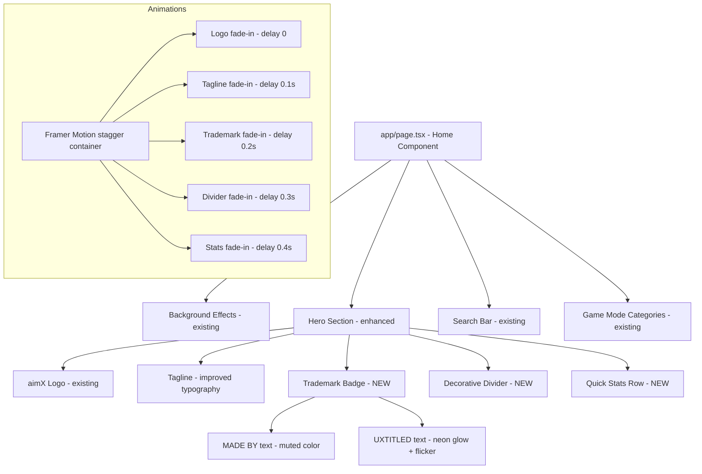
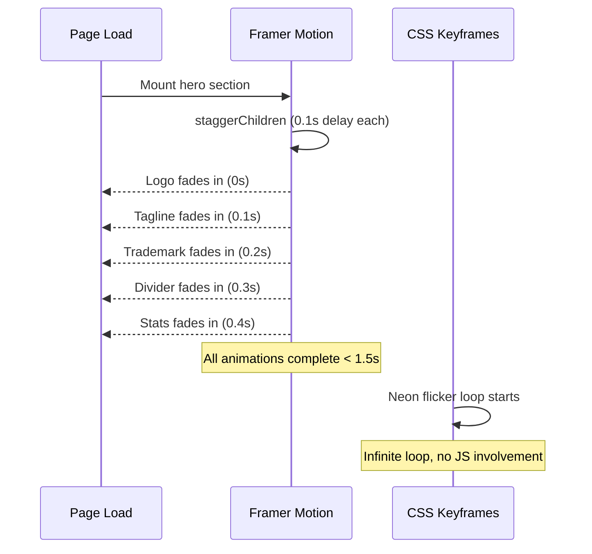

# Design Document: Main Page Improvement

## Overview

This design enhances the aimX main page hero section to create a more visually engaging and branded experience. The improvements include a "MADE BY UXTITLED" trademark badge with neon flickering effects, additional visual density elements (quick stats, decorative accents), improved typography/spacing, and staggered entrance animations using Framer Motion.

All changes are scoped to `app/page.tsx` and `app/globals.css`, leveraging the existing Framer Motion and GSAP libraries already installed in the project. The dark theme (#08080a background, red-600 accents) and existing component architecture (Sidebar, Particles) remain unchanged.

### Design Decisions

1. **Framer Motion over GSAP for entrance animations**: Framer Motion integrates more naturally with React's declarative model and is already used in the project. GSAP is better suited for complex timeline-based animations (like the game canvas), while Framer Motion handles staggered fade-ins cleanly with `motion.div` and `staggerChildren`.

2. **CSS keyframes for neon flicker**: The neon blinking effect is a continuous, looping animation that doesn't depend on React state. Pure CSS `@keyframes` is more performant than JS-driven animation for this use case — no re-renders, GPU-accelerated, and simpler to maintain.

3. **Inline stat values (not fetched)**: Quick stats are hardcoded/computed from the existing `modes` array (e.g., total game modes, categories count). No API calls or localStorage reads are needed — this keeps the hero section fast and avoids layout shift.

4. **No new components**: All additions live within the existing `Home` component in `app/page.tsx`. The hero section is small enough that extracting sub-components would add indirection without meaningful benefit.

## Architecture

The enhancement modifies the existing page structure without introducing new routing, data fetching, or state management patterns.



### Animation Flow



## Components and Interfaces

### Modified: `app/page.tsx` — Home Component

The hero `<header>` section is expanded with new elements wrapped in Framer Motion's `motion.div` for staggered entrance.

```typescript
// New imports added
import { motion } from 'framer-motion';

// Stagger animation variants
const heroContainerVariants = {
  hidden: { opacity: 0 },
  visible: {
    opacity: 1,
    transition: {
      staggerChildren: 0.1,
      delayChildren: 0.1,
    },
  },
};

const heroItemVariants = {
  hidden: { opacity: 0, y: 20 },
  visible: {
    opacity: 1,
    y: 0,
    transition: { duration: 0.5, ease: 'easeOut' },
  },
};
```

### New Element: Trademark Badge

```tsx
<motion.div variants={heroItemVariants} className="flex items-center gap-2 text-sm tracking-widest">
  <span className="text-[#555555] font-medium">MADE BY</span>
  <span className="neon-text text-red-500 font-bold">UXTITLED</span>
</motion.div>
```

### New Element: Decorative Divider

A subtle horizontal accent between the trademark and stats:

```tsx
<motion.div variants={heroItemVariants} className="w-48 h-px bg-gradient-to-r from-transparent via-red-600/30 to-transparent" />
```

### New Element: Quick Stats Row

```tsx
<motion.div variants={heroItemVariants} className="flex items-center gap-8 text-center">
  <div>
    <div className="text-2xl font-bold text-white">11</div>
    <div className="text-xs text-[#555555] uppercase tracking-wider">Game Modes</div>
  </div>
  <div className="w-px h-8 bg-white/10" />
  <div>
    <div className="text-2xl font-bold text-white">4</div>
    <div className="text-xs text-[#555555] uppercase tracking-wider">Categories</div>
  </div>
  <div className="w-px h-8 bg-white/10" />
  <div>
    <div className="text-2xl font-bold text-red-500">∞</div>
    <div className="text-xs text-[#555555] uppercase tracking-wider">Potential</div>
  </div>
</motion.div>
```

### Modified: `app/globals.css` — Neon Animation

```css
/* Neon flicker animation for UXTITLED text */
@keyframes neon-flicker {
  0%, 19%, 21%, 23%, 25%, 54%, 56%, 100% {
    text-shadow:
      0 0 4px #ff2d2d,
      0 0 11px #ff2d2d,
      0 0 19px #ff2d2d,
      0 0 40px #dc2626,
      0 0 80px #dc2626;
    opacity: 1;
  }
  20%, 24%, 55% {
    text-shadow: none;
    opacity: 0.8;
  }
}

.neon-text {
  animation: neon-flicker 3s infinite;
  text-shadow:
    0 0 4px #ff2d2d,
    0 0 11px #ff2d2d,
    0 0 19px #ff2d2d,
    0 0 40px #dc2626,
    0 0 80px #dc2626;
}
```

## Data Models

No new data models are introduced. The quick stats are derived from the existing `modes` array and `categories` array already defined in `app/page.tsx`:

```typescript
// Already exists in page.tsx
const modes = [...]; // 11 items
const categories = ['Flicking', 'Tracking', 'Speed', 'Precision']; // 4 items

// Stats are computed inline, no new state needed
```

## Error Handling

This feature is purely presentational with no data fetching, user input processing, or async operations that could fail. Error handling considerations:

1. **Framer Motion not loading**: The `motion.div` components degrade gracefully — if Framer Motion fails to load, elements render as static `div`s without animation. Content remains visible and functional.

2. **CSS animation performance**: The neon flicker uses `text-shadow` and `opacity` which are GPU-compositable properties. On low-end devices, the animation may appear less smooth but won't block interaction or cause layout shifts.

3. **Font loading delay**: The tagline uses the existing Geist font already configured in `layout.tsx`. If the font fails to load, the system fallback (Arial/Helvetica) maintains readability.

4. **Viewport considerations**: Stats row uses `flex-wrap` behavior — on very narrow viewports (< 360px), items stack naturally. The `max-w-md` constraint on the hero content prevents text from stretching too wide on ultrawide displays.

## Testing Strategy

### Why Property-Based Testing Does NOT Apply

This feature consists entirely of:
- UI rendering and layout (visual composition of elements)
- CSS animations (neon flicker effect)
- Visual styling (typography, spacing, colors)
- Entrance animations (Framer Motion stagger)

None of these have universal properties that vary meaningfully with input. There are no pure functions, data transformations, parsers, or business logic to validate across a range of inputs. The correct testing approach is example-based visual/integration testing.

### Recommended Testing Approach

**Visual/Snapshot Tests:**
- Verify the hero section renders all required elements (logo, tagline, trademark badge, divider, stats)
- Verify "UXTITLED" text has the `neon-text` CSS class applied
- Verify "MADE BY" and "UXTITLED" are rendered as separate styled spans

**Example-Based Unit Tests:**
- Trademark badge renders with correct text content ("MADE BY" + "UXTITLED")
- Stats row displays correct counts (11 game modes, 4 categories)
- Hero section elements are wrapped in Framer Motion `motion.div` components
- Neon animation CSS class is present on the UXTITLED element

**Manual/Visual Regression Tests:**
- Neon flicker animation runs continuously and maintains readability (opacity ≥ 0.7)
- Staggered entrance animations complete within 1.5 seconds
- Visual hierarchy preserved (aimX logo remains primary focal point)
- Elements visible without scrolling on 1920x1080 viewport
- Dark theme consistency (no color clashes with existing red accents)

**Accessibility Checks:**
- Ensure neon animation respects `prefers-reduced-motion` media query
- Verify sufficient color contrast for "MADE BY" text against dark background
- Stats row is readable by screen readers (semantic markup)
