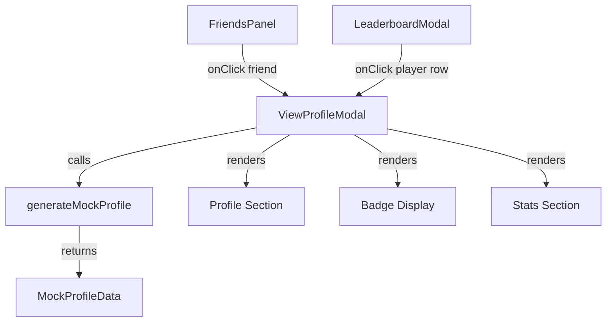

# Design Document: View Profile

## Overview

The View Profile feature adds a read-only modal (`ViewProfileModal`) that displays another player's profile information. It is triggered by clicking a friend entry in the FriendsPanel or a player row in the LeaderboardModal. Profile data for other players is deterministically generated from their user ID using a mock profile generator function, since there is no backend.

The feature consists of three parts:
1. **ViewProfileModal** — A framer-motion animated modal displaying avatar, border, badge, title, user ID, equipped badges, and stats
2. **generateMockProfile()** — A pure function that deterministically produces profile data from a player ID using seeded randomness
3. **Integration points** — onClick handlers added to FriendsPanel entries and LeaderboardModal player rows

## Architecture



The architecture is simple and flat:
- `ViewProfileModal` is a standalone component that receives a player's basic info (id, username, badge) and an `onClose` callback
- On mount, it calls `generateMockProfile(playerId)` to get the full profile data
- The modal renders three sections: profile header, badge display, and stats
- No state management beyond open/close is needed — the modal is stateless and read-only

## Components and Interfaces

### ViewProfileModal Component

**File:** `components/ViewProfileModal.tsx`

```typescript
interface ViewProfileModalProps {
  isOpen: boolean;
  onClose: () => void;
  player: {
    id: string;
    username: string;
    badge: string;  // title/rank badge name from mock data
  };
}
```

**Behavior:**
- Uses `AnimatePresence` and `motion.div` from framer-motion (same pattern as EditProfileModal)
- Calls `generateMockProfile(player.id)` to get avatar, border, equipped badges, and stats
- Renders a backdrop with `bg-black/60 backdrop-blur-sm` that closes modal on click
- Listens for Escape key to close
- Contains no editable fields or save actions

**Sections:**
1. **Header** — Close button (X icon), "Player Profile" title
2. **Profile Section** — Avatar (with border overlay), username, badge/title, user ID
3. **Badge Display** — Up to 3 badge images in a row, empty slots shown as placeholders
4. **Stats Section** — Three stat cards: Total Play Time, Accuracy, Favorite Mode

### generateMockProfile Function

**File:** `lib/mockProfile.ts`

```typescript
interface MockProfileData {
  profilePicture: string | null;       // Always null for mock players (no uploaded photos)
  equippedBorder: string | null;       // Border image filename or null
  equippedBadges: string[];            // 0-3 badge image filenames
  stats: {
    totalPlayTime: number;             // In minutes
    accuracy: number;                  // 0-100 percentage
    favoriteMode: string;              // Game mode name
  };
}

function generateMockProfile(playerId: string): MockProfileData;
```

**Behavior:**
- Uses a seeded random number generator (same `seededRandom` pattern as `lib/mockData.ts`) based on a numeric hash of the player ID string
- Deterministically selects a border from the available border images (or null for ~20% of players)
- Deterministically selects 0-3 badges from the available badge images
- Generates stats: play time (10-500 minutes), accuracy (60-99%), favorite mode from GAME_MODES list
- Same input always produces same output (pure function, no side effects)

### Integration Points

**FriendsPanel (in `components/Sidebar.tsx`):**
- Add `onClick` to each friend entry `<div>`
- On click, set state to open ViewProfileModal with `{ id: friend.id, username: friend.username, badge: friend.badge }`

**LeaderboardModal (in `components/LeaderboardModal.tsx`):**
- Add `onClick` to each player row `<div>`
- On click, set state to open ViewProfileModal with `{ id: player.id, username: player.username, badge: player.badge }`
- ViewProfileModal renders on top of LeaderboardModal (higher z-index)

## Data Models

### MockProfileData

| Field | Type | Description |
|-------|------|-------------|
| profilePicture | `string \| null` | Always `null` for mock players |
| equippedBorder | `string \| null` | Filename from border images (e.g., `"03_purple_hex_BORDER.png"`) or null |
| equippedBadges | `string[]` | 0-3 badge filenames (e.g., `["Aim Addict.png", "Sharp Eyes.png"]`) |
| stats.totalPlayTime | `number` | Total play time in minutes (10-500) |
| stats.accuracy | `number` | Accuracy percentage (60-99) |
| stats.favoriteMode | `string` | Game mode display name (e.g., `"Gridshot"`, `"Flick Shot"`) |

### Available Assets

**Borders** (selected by generator):
- `01_crosshair_red_BORDER.png` through `07_shatter_red_BORDER.png` (normal)
- `luxury_01_royal_gold_BORDER.png` through `luxury_03_obsidian_crimson_BORDER.png` (luxury)

**Badges** (selected by generator):
- `Aim Addict.png`, `Aim Never Sleeps.png`, `Endless Training.png`, `High Roller.png`, `Legendary Run.png`, `Lightning Reflex.png`, `Magnet Aim.png`, `Missed Everything.png`, `Potato Aim.png`, `Quickscope.png`, `Sharp Eyes.png`, `Skull Cracker.png`, `Top 1%.png`, `Top 5%.png`, `Top 10%.png`, `Ultra Instinct.png`, `Weekly Warrior.png`

## Correctness Properties

*A property is a characteristic or behavior that should hold true across all valid executions of a system — essentially, a formal statement about what the system should do. Properties serve as the bridge between human-readable specifications and machine-verifiable correctness guarantees.*

### Property 1: Deterministic profile generation

*For any* player ID string, calling `generateMockProfile` multiple times SHALL always return deeply equal results.

**Validates: Requirements 8.1, 8.2, 8.3, 8.4, 8.5**

### Property 2: Badge count invariant

*For any* player ID string, the `equippedBadges` array returned by `generateMockProfile` SHALL have a length between 0 and 3 (inclusive).

**Validates: Requirements 4.1, 8.3**

### Property 3: Stats within valid ranges

*For any* player ID string, the generated stats SHALL have accuracy between 0 and 100, totalPlayTime as a non-negative number, and favoriteMode as one of the known game mode names.

**Validates: Requirements 5.1, 5.2, 5.3, 8.4**

### Property 4: Border selection from valid set

*For any* player ID string, if `equippedBorder` is not null, it SHALL be one of the known border image filenames from the public/images directory.

**Validates: Requirements 3.2, 8.2**

### Property 5: Badge selection from valid set

*For any* player ID string, every entry in `equippedBadges` SHALL be one of the known badge image filenames from the public/images directory, with no duplicates.

**Validates: Requirements 4.3, 8.3**

## Error Handling

This feature has minimal error surface since it uses only mock data and local rendering:

| Scenario | Handling |
|----------|----------|
| Player ID is empty string | Generator still produces deterministic output (hash of empty string) |
| Border image fails to load | CSS fallback — avatar displays without border decoration |
| Badge image fails to load | Show placeholder icon in badge slot |
| Modal opened with missing player data | Display "Unknown Player" with default avatar and empty stats |

No network calls, no async operations, no error boundaries needed beyond standard React error handling.

## Testing Strategy

### Property-Based Tests (fast-check)

The `generateMockProfile` function is a pure function with clear input/output behavior, making it ideal for property-based testing. Each correctness property maps to a single property-based test.

- **Library:** fast-check
- **Minimum iterations:** 100 per property
- **Target:** `lib/mockProfile.ts` — the `generateMockProfile` function
- **Tag format:** `Feature: view-profile, Property {N}: {description}`

Property tests verify:
1. Determinism (same input → same output)
2. Badge count invariant (0-3)
3. Stats range validity
4. Border from valid set
5. Badges from valid set with no duplicates

### Unit Tests (vitest)

Example-based tests for specific scenarios:
- Modal opens when friend entry is clicked (integration with FriendsPanel)
- Modal opens when leaderboard row is clicked (integration with LeaderboardModal)
- Modal closes on close button click, backdrop click, and Escape key
- Modal renders correct sections (profile, badges, stats)
- Empty badge slots show placeholders when fewer than 3 badges equipped
- Modal contains no editable fields or save buttons
- Framer-motion animations are applied (AnimatePresence wrapping)

### Visual/Manual Tests

- Dark theme consistency with existing modals
- Backdrop blur effect
- Animation smoothness on open/close
- Responsive layout within modal
